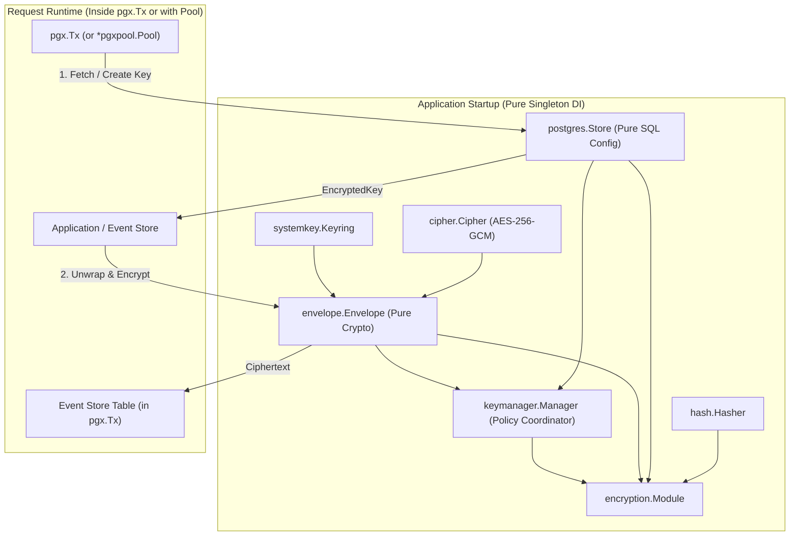

# Architecture Plan: Decoupled Pure Envelope Crypto & Stateless `pgxConn` Keystore

## Goal Description
Refactor `eventsalsa/encryption` aggressively for version `0.0.*` to establish an **idealistically pure, idiomatic Go architecture**:
1. **Decouple Envelope Cryptography from Storage**: Separate the in-memory envelope crypto engine (`envelope.Envelope`) from the database storage layer (`keystore/postgres`).
2. **Eliminate All Stateful Store & Context Magic**: Remove `*pgxpool.Pool` from `postgres.Store`, delete `keystore/context.go`, purge `pgx` dependencies from the root `keystore` package, and eliminate all silent fallback mechanisms.
3. **Stateless `pgxConn` Storage**: Make `postgres.Store` and `keymanager.Manager` pure singletons whose query methods accept an explicit `pgxConn` handle (`pgx.Tx` or `*pgxpool.Pool`).
4. **100% Clean Dependency Injection**: Enable all services, crypto envelopes, and stores to be instantiated once at application startup as immutable singletons.
5. **Strict Single Responsibility Principle (SRP)**:
   - `postgres.Store` is 100% CRUD key persistence; administrative batch migrations (`RewrapSystemKeys`) become a standalone admin function.
   - `keymanager.Manager` enforces DEK lifecycle policy only; all key generation and wrapping are delegated to `envelope.Envelope`.
6. **Bin Over-Engineered Fluff (`pii/` & `secret/`)**: Remove `pii` and `secret` packages completely. The core primitives (`(scope, scopeID)` namespaces, `KeyManager`, and `Envelope`) handle crypto-shredding and key rotation natively without domain boilerplate.

---

## Architecture Overview

---

## Summary of Changes

### 1. Pure Symmetric & Envelope Crypto Layer
- Replaced `envelope.Encryptor` with pure in-memory `envelope.Envelope`.
- `Envelope` handles `Encrypt`, `Decrypt`, `WrapDEK`, `UnwrapDEK`, `GenerateDEK`, `ActiveKeyID`.
- Zero database or context dependencies.

### 2. Storage Abstraction & PostgreSQL Adapter
- Deleted `keystore/context.go` and `keystore/context_test.go`.
- `postgres.Store` is a stateless configuration struct.
- Added `postgres.PgxConn` interface.
- All store methods take `(ctx context.Context, conn PgxConn, ...)`.
- Standalone admin function `postgres.RewrapSystemKeys(ctx, pool, cfg, keyring, cipher, opts)`.

### 3. Key Lifecycle Manager
- `keymanager.Manager` coordinates DEK lifecycle using `store` and `env`.
- All methods accept `conn postgres.PgxConn`.

### 4. Removed Domain Packages
- Deleted `pii/` and `secret/` packages.

### 5. Verification
- `go test -race ./...`
- `go test -race -tags=integration ./keystore/postgres/...`
- `make check`
