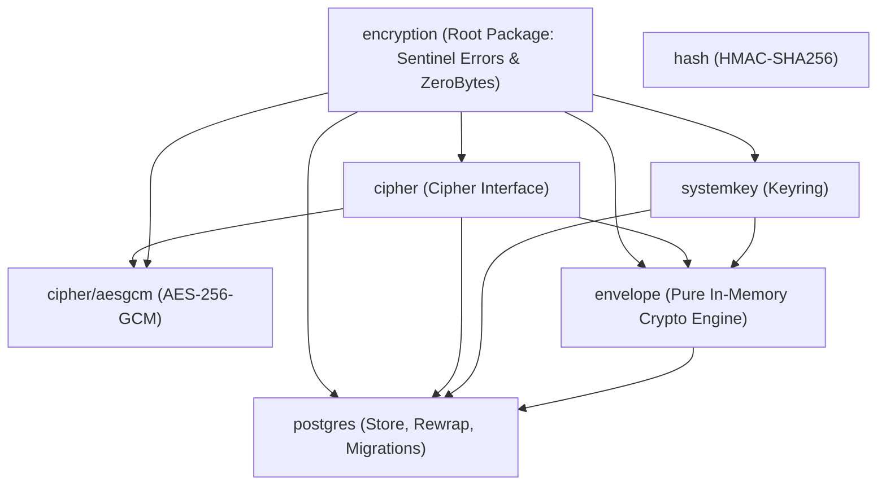

# Idealistic Architecture Plan: Pure In-Memory Envelope Crypto & Cohesive Postgres Keystore

## Goal Description

Refactor `eventsalsa/encryption` from the ground up for the `v0.0.*` series to achieve an **idealistically pure, idiomatic Go architecture**:
1. **Eliminate All Leaky Abstractions & Pseudo-Generic Wrappers**: Remove the artificial separation between `keystore/`, `keystore/postgres/`, `keymanager/`, and `encerr/`.
2. **Pure In-Memory Cryptographic Engine (`envelope`)**: Zero database, zero transaction, zero context dependencies.
3. **Cohesive, Stateless Postgres Keystore (`postgres`)**: A single, clean PostgreSQL package implementing DEK persistence and lifecycle management (`CreateKey`, `RotateKey`, `GetActiveKey`, `GetKey`, `RevokeKeys`, `DestroyKeys`), administrative system-key rewrapping (`RewrapSystemKeys`), and migration generation.
4. **Completely Unexported `pgxConn`**: The executor interface in `postgres` is strictly unexported (`type pgxConn interface`). It never leaks into the public API. Callers simply pass `*pgxpool.Pool`, `pgx.Tx`, or `*pgx.Conn`.
5. **Elimination of `Module` Monolith**: Applications instantiate and inject the discrete components they need (`envelope.New(...)` and `postgres.NewStore(...)`). No artificial module bundling.
6. **Elimination of `encerr`**: Sentinel errors and `ZeroBytes` live directly in the root package `encryption`, with zero internal imports (preventing circular dependencies naturally).
7. **Clean Repository**: Permanently delete `.agents/skills` and `.agents/rules`.

---

## Detailed Rationale & Review Responses

### 1. Why `keystore/` and `keymanager/` are Redundant & Eliminated
In the original architecture, `keystore/`, `keystore/postgres/`, and `keymanager/` were split across 3 separate packages:

```
[Application] ──> [keymanager.Manager] ──> [keystore.KeyStore interface] ──> [keystore/postgres.Store]
```

#### Why `keystore/` is Redundant:
1. **The "Generic Keystore" Illusion**: The root `keystore` package only defined an interface (`KeyStore`) and a data transfer struct (`EncryptedKey`). In event-sourced Go systems with explicit transaction propagation, database drivers cannot be abstracted cleanly behind a generic, driver-agnostic interface without ugly hacks (like context reflection or `any` connection types).
2. **Needless Nesting**: With `context.go` eliminated (since `conn pgxConn` is passed explicitly), `keystore/` became an empty shell holding only a 7-field struct while all actual implementation lived in `keystore/postgres/`.
3. **Consolidation**: Moving `EncryptedKey` and SQL queries directly into package `postgres` collocates the persistence model with its SQL implementation, eliminating a layer of package nesting.

#### Why `keymanager/` is Redundant:
1. **Paper-Thin Pass-Through**: `keymanager.Manager` had 5 methods:
   - `CreateKey`: generated bytes, wrapped with KEK, called `store.CreateKey`.
   - `RotateKey`: generated bytes, wrapped with KEK, called `store.CreateKey` + `store.RevokeKeys`.
   - `RevokeKeys`: 100% pass-through forwarding to `store.RevokeKeys`.
   - `DestroyKeys`: 100% pass-through forwarding to `store.DestroyKeys`.
   - `ActiveKeyVersion`: 100% pass-through forwarding to `store.GetActiveKey`.
2. **Crypto Delegated to `Envelope`**: All cryptographic generation and DEK wrapping/unwrapping (`GenerateDEK`, `WrapDEK`, `UnwrapDEK`) belong in `envelope.Envelope`.
3. **Lifecycle Collocation in `postgres.Store`**: When `postgres.Store` is constructed with `env *envelope.Envelope` (`postgres.NewStore(env, cfg)`), `Store` handles `CreateKey` and `RotateKey` natively in a single step (generate/wrap via `env` + persist via SQL).
4. **Eliminates Abstraction Inversion**: `keymanager` previously had to import `keystore/postgres` just to receive `pgxConn`. Eliminating `keymanager` dissolves this dependency inversion completely.

---

### 2. Unexported `pgxConn` (L171)
The interface for database executors inside `postgres` will be strictly **unexported**:
```go
package postgres

type pgxConn interface {
    Query(ctx context.Context, sql string, args ...any) (pgx.Rows, error)
    QueryRow(ctx context.Context, sql string, args ...any) pgx.Row
    Exec(ctx context.Context, sql string, args ...any) (pgconn.CommandTag, error)
}
```
- There will be **no exported alias**, no `PgxConn`, and no leaking of this interface.
- In Go, an unexported interface parameter `conn pgxConn` on exported methods like `func (s *Store) CreateKey(ctx context.Context, conn pgxConn, scope, scopeID string)` allows callers to pass `*pgxpool.Pool`, `pgx.Tx`, or `*pgx.Conn` directly without forcing the caller to know or import an interface name.

---

### 3. Why `Module` is Eliminated (L263)
- **Zero Real Value**: `encryption.Module` was merely a struct holding `Envelope`, `Store`, and `Hasher` pointers.
- **Violates Interface Segregation**: In clean Go architectures (CQRS, DDD, Hexagonal), different services need different dependencies. An event store codec only needs `*envelope.Envelope`, while an aggregate repository or user service only needs `*postgres.Store`. Nobody injects a monolithic `Module` bundle.
- **Idiomatic Go Construction**: Standard Go applications construct components at startup via pure dependency injection:
  ```go
  keyring := systemkey.NewKeyring(...)
  c := aesgcm.New()
  env := envelope.New(keyring, c)
  store := postgres.NewStore(env, postgres.Config{})
  ```

---

## Dependency Graph (Clean & Acyclic)



### Clean Package Layout (7 Packages Total)

| Package | Role | Dependencies |
| :--- | :--- | :--- |
| `encryption` (root) | Sentinel errors (`ErrKeyNotFound`, `ErrKeyExists`, etc.) and `ZeroBytes` | stdlib only (zero internal imports) |
| `cipher` | `Cipher` symmetric encryption interface | `encryption` |
| `cipher/aesgcm` | AES-256-GCM cipher implementation | `encryption`, `cipher` |
| `systemkey` | KEK management abstractions and filesystem loaders | `encryption` |
| `hash` | Deterministic HMAC-SHA256 blind indexing | stdlib only |
| `envelope` | Pure in-memory envelope crypto engine (`Encrypt`, `Decrypt`, `WrapDEK`, `UnwrapDEK`, `GenerateDEK`, `ActiveKeyID`) | `encryption`, `cipher`, `systemkey` |
| `postgres` | Stateless PostgreSQL keystore (`Store`), admin `RewrapSystemKeys`, and migrations | `encryption`, `cipher`, `systemkey`, `envelope`, `pgx/v5` |

---

## Proposed Changes

### 1. Root Package `encryption` (Errors & Memory Hygiene)

#### [MODIFY] `errors.go` & `zerobytes.go`
- Define sentinel errors in root `encryption`:
  - `ErrKeyNotFound`
  - `ErrKeyExists`
  - `ErrInvalidKeySize`
  - `ErrCiphertextTooShort`
  - `ErrDecryptionFailed`
  - `ErrInvalidKeyVersion`
- Define `ZeroBytes(b []byte)`.
- Delete `Config` and `Module`.
- Delete `encerr/` directory.

---

### 2. Package `envelope` (Pure In-Memory Crypto Engine)

#### [MODIFY] `envelope/envelope.go`
```go
package envelope

import (
	"crypto/rand"
	"encoding/base64"
	"fmt"
	"io"

	"github.com/eventsalsa/encryption"
	"github.com/eventsalsa/encryption/cipher"
	"github.com/eventsalsa/encryption/systemkey"
)

type Envelope struct {
	keyring systemkey.Keyring
	cipher  cipher.Cipher
}

func New(keyring systemkey.Keyring, c cipher.Cipher) *Envelope {
	return &Envelope{keyring: keyring, cipher: c}
}

func (e *Envelope) Encrypt(systemKeyID string, encryptedDEK []byte, plaintext string) (string, error)
func (e *Envelope) Decrypt(systemKeyID string, encryptedDEK []byte, ciphertext string) (string, error)
func (e *Envelope) WrapDEK(systemKeyID string, dek []byte) ([]byte, error)
func (e *Envelope) UnwrapDEK(systemKeyID string, encryptedDEK []byte) ([]byte, error)
func (e *Envelope) GenerateDEK() ([]byte, error)
func (e *Envelope) ActiveKeyID() string
```

---

### 3. Package `postgres` (Consolidated PostgreSQL Keystore & Lifecycle)

Move `keystore/postgres` directly to `postgres/`. Delete `keystore/` and `keymanager/`.

#### [NEW / MOVE] `postgres/store.go`
```go
package postgres

import (
	"context"
	"errors"
	"fmt"
	"time"

	"github.com/eventsalsa/encryption"
	"github.com/eventsalsa/encryption/envelope"
	"github.com/jackc/pgx/v5"
	"github.com/jackc/pgx/v5/pgconn"
)

// pgxConn is strictly unexported and represents any pgx database executor.
type pgxConn interface {
	Query(ctx context.Context, sql string, args ...any) (pgx.Rows, error)
	QueryRow(ctx context.Context, sql string, args ...any) pgx.Row
	Exec(ctx context.Context, sql string, args ...any) (pgconn.CommandTag, error)
}

type EncryptedKey struct {
	Scope        string
	ScopeID      string
	KeyVersion   int
	EncryptedDEK []byte
	SystemKeyID  string
	CreatedAt    time.Time
	RevokedAt    *time.Time
}

type Store struct {
	env *envelope.Envelope
	cfg Config
}

func NewStore(env *envelope.Envelope, cfg Config) *Store {
	return &Store{
		env: env,
		cfg: ApplyDefaults(cfg),
	}
}

func (s *Store) CreateKey(ctx context.Context, conn pgxConn, scope, scopeID string) (int, error)
func (s *Store) RotateKey(ctx context.Context, conn pgxConn, scope, scopeID string) (int, error)
func (s *Store) GetActiveKey(ctx context.Context, conn pgxConn, scope, scopeID string) (*EncryptedKey, error)
func (s *Store) GetKey(ctx context.Context, conn pgxConn, scope, scopeID string, version int) (*EncryptedKey, error)
func (s *Store) RevokeKeys(ctx context.Context, conn pgxConn, scope, scopeID string) error
func (s *Store) DestroyKeys(ctx context.Context, conn pgxConn, scope, scopeID string) error
func (s *Store) ActiveKeyVersion(ctx context.Context, conn pgxConn, scope, scopeID string) (int, error)
```

#### [NEW / MOVE] `postgres/rewrap.go`
```go
package postgres

func RewrapSystemKeys(
	ctx context.Context,
	pool *pgxpool.Pool,
	cfg Config,
	keyring systemkey.Keyring,
	c cipher.Cipher,
	opts RewrapSystemKeysOptions,
) (RewrapSystemKeysResult, error)
```

---

### 4. Delete Obsolete Packages & Folders

- [DELETE] `encerr/`
- [DELETE] `keystore/`
- [DELETE] `keymanager/`
- [DELETE] `.agents/skills/`
- [DELETE] `.agents/rules/`

---

### 5. Update Examples & Docs

- `examples/basic/main.go`: Shows clean setup with `envelope.New` and `postgres.NewStore`.
- `examples/pii/main.go`: Shows GDPR crypto-shredding via `store.DestroyKeys(ctx, pool, ...)`.
- `examples/secrets/main.go`: Shows key rotation via `store.RotateKey(ctx, pool, ...)`.
- `README.md`, `doc.go`, `AGENTS.md`.

---

## Verification Plan

### Automated Tests
1. **Unit Tests**: `go test -race -v ./...`
2. **Integration Tests**: `go test -race -tags=integration -v ./postgres/...`
3. **Full Validation Suite**:
   ```bash
   gofmt -s -w .
   go vet ./...
   golangci-lint run --timeout=5m
   go build ./...
   ```
