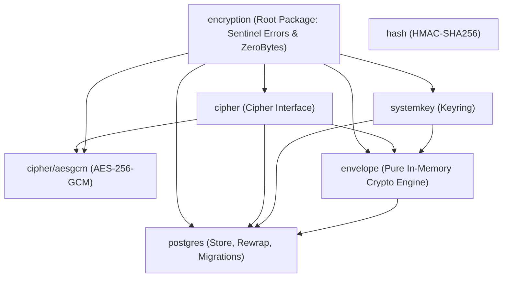

# Walkthrough: Pure In-Memory Envelope Crypto & Consolidated Postgres Keystore

## Summary

This refactor establishes an **idealistic, pure, and cohesive architecture** for `eventsalsa/encryption`:
1. **Consolidated PostgreSQL Keystore (`postgres`)**:
   - Merged `keystore/postgres` and `keymanager` into a single, cohesive `postgres.Store`.
   - DEK generation, wrapping with KEK, and SQL persistence are handled in unified methods (`CreateKey`, `RotateKey`, `GetActiveKey`, `GetKey`, `RevokeKeys`, `DestroyKeys`, `ActiveKeyVersion`).
   - The database executor interface `pgxConn` is **strictly unexported** (`type pgxConn interface`). It never leaks into the public API. Callers pass standard `*pgxpool.Pool`, `pgx.Tx`, or `*pgx.Conn` directly.
2. **Pure In-Memory Cryptographic Engine (`envelope`)**:
   - `envelope.Envelope` has **zero database, transaction, or context dependencies**.
   - Handles in-memory DEK generation, wrapping/unwrapping, and data encryption/decryption (`Encrypt`, `Decrypt`, `WrapDEK`, `UnwrapDEK`, `GenerateDEK`, `ActiveKeyID`).
3. **Pure Root Package & Eliminated `encerr`**:
   - Root package `encryption` defines sentinel errors (`ErrKeyNotFound`, etc.) and memory hygiene utilities (`ZeroBytes`).
   - Has **zero internal imports**, naturally eliminating circular dependencies without needing a separate `encerr/` package.
4. **Eliminated `Module` Monolith**:
   - Removed `encryption.Module` in favor of standard idiomatic Go constructor injection (`envelope.New(...)`, `postgres.NewStore(...)`).
5. **Deleted Redundant Directories**:
   - Permanently deleted `keystore/`, `keymanager/`, `encerr/`, `.agents/skills/`, and `.agents/rules/`.

---

## Clean Architecture (7 Acyclic Packages)



---

## Verification Results

### 1. Unit Tests
```bash
go test -race ./...
```
All unit tests pass with zero race conditions.

### 2. Integration Tests (PostgreSQL via Testcontainers)
```bash
go test -race -tags=integration -v ./postgres/...
```
All 13 integration test suites passed (CRUD, key rotation, scope isolation, transaction rollback/commit, migration idempotency, concurrent creation, dry-run and live system-key rewrapping).

### 3. Code Quality & Linters
```bash
gofmt -s -w .
go vet ./...
golangci-lint run --timeout=5m
```
Passed with 0 issues.

### 4. Runnable Examples
- `go run ./examples/basic/main.go` — Verified in-memory envelope crypto workflow.
- `go run ./examples/pii/main.go` — Verified GDPR crypto-shredding.
- `go run ./examples/secrets/main.go` — Verified zero-downtime key rotation.
